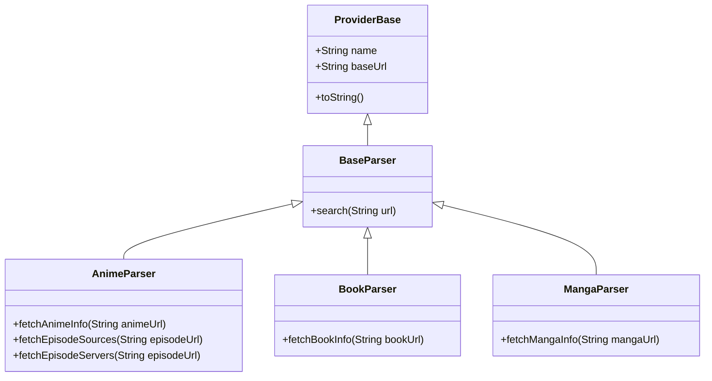
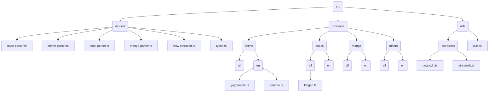

# Consumet Extentions
to build the consumet extension privately you need to run the following command:
```
tsc
```
And then on the consumet repository run:
```
yarn add path/to/consumet-extension // find the path to the consumet-extension
```




# Requests

# Contributing
